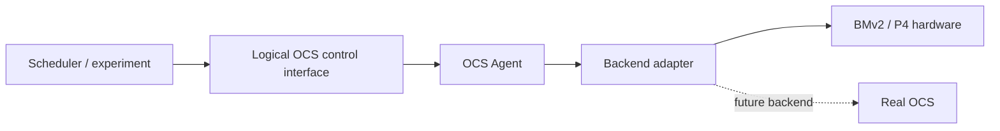

  <picture>
    <source media="(prefers-color-scheme: dark)" srcset="docs/assets/branding/reconfignet-sim-logo-dark.svg">
    
  </picture>

<h3 align="center">
Programmable-switch research infrastructure for reconfigurable optical networks.
</h3>

  <a href="README.md"><b>English</b></a>

  
  
  

ReconfigNet-Sim 是一个基于可编程交换机、用于低成本研究可重构光网络周边系统集成、控制和部署问题的平台。

## 项目动机（Motivation）

我们的核心动机不是再构造一个 OCS 数据面仿真器，而是：在真实光交换硬件可用之前，使用仿真来暴露、研究并降低可重构网络周边系统集成问题的风险。

可重构光路交换机（OCS）硬件仍然难以获取和运维。很多设备处于研究原型或早期产品阶段，量产规模有限，软件配套不完整，搭建有代表性的光交换实验环境也需要较高成本。

这种稀缺性会形成系统集成空白。调度器、控制器、端侧配置、拓扑假设、部署自动化和故障处理通常需要在真实 OCS 可用前开始开发，而这些环节中的问题可能直到稀缺硬件真正接入时才暴露。

ReconfigNet-Sim 使用可编程交换机进行仿真，让这些问题更早出现。它不是光学验证的替代品，而是一套可持续使用的研究基础设施：用于开发 OCS 周边系统、测量控制行为，并明确哪些结论能够或不能迁移到真实 OCS。

> [!NOTE]
> ReconfigNet-Sim 是用于系统集成实验的研究基础设施，不是光学验证的替代品。所有结果都应放在文档明确的模型边界内解释。

## 平台覆盖的内容

平台覆盖研究可重构网络系统集成所需的行为。具体 model 会随着相关研究演进，通常包括：

- 动态可重构网络周边的控制和编排逻辑；
- 影响系统集成的端侧、拓扑和部署假设；
- connection workflow、状态转换、合法性检查、恢复和失败处理；
- client、controller、Agent、device backend 与可编程交换机 target 之间的交互；
- 用于测量控制路径和数据面影响的 instrumentation。

可执行 model 和 transaction 细节集中放在 [OCS Agent 架构](docs/ocs-agent-architecture.md)、[控制语义](docs/ocs-control-semantics.md)和[仿真原理与边界](docs/ocs-simulation-principles-and-boundaries-zh.md)中，使它们可以演进而不改变项目的高层承诺。

## 我们不仿真什么

ReconfigNet-Sim 不仿真或测量：

- 光传播、插损、光功率、BER 或信号质量；
- MEMS、硅光等物理交换机制；
- transceiver tuning、激光器或波长相关行为；
- 物理链路丢失和重新捕获；
- PHY training、NIC 初始化或驱动恢复；
- 任意一层、二层协议的透明转发；
- 真实光路重构的数据面原子性或精确时序。

这些缺失是有意为之。这样可以让模型保持实用，同时不会把包交换机状态包装成光学事实。精确假设见 [OCS 仿真原理与边界](docs/ocs-simulation-principles-and-boundaries-zh.md)。

> [!WARNING]
> ReconfigNet-Sim 的 packet-level 结果不能直接作为光交换时间、物理链路恢复时间或端到端 OCS 等价性的证据。

## 为什么选择 P4？（Why P4?）

P4 交换机提供了一个可控的近似边界，使许多 OCS 系统集成问题能够在真实硬件可用前，以及与真实硬件并行时得到研究。

P4 为这个项目提供了两个互补的实验层次：

- **BMv2/P4App** 提供成本低、可复现、迭代快的软件 target，适合早期 controller、端侧、部署和失败流程实验。
- **Tofino** 提供更成熟的可编程硬件路径、packet-processing pipeline 以及 BF-SDE/BFRT 开发环境，可以在更接近生产可编程交换机部署的条件下测试相同的系统集成问题。

两者都不提供光学行为。BMv2/P4App 在依赖真实 RDMA NIC 交互、PHY 行为、链路训练或硬件时序的实验中，保真度可能较弱。Tofino 可以缩小部分可编程硬件和部署层面的差距，但它仍然是电交换机，不会复现光交换机制。

更完整的 P4 开发环境见 [Open P4 Studio](https://github.com/p4lang/open-p4studio)。本项目把 P4 作为可控的实验边界，而不是声称包交换机就是物理 OCS。

> [!NOTE]
> BMv2/P4App 与 Tofino 是互补的可编程交换机验证层：BMv2 更适合快速、可复现的迭代，Tofino 更适合检验接近硬件和部署环境的问题。两者都不会增加光学保真度。

## 可以研究的问题

这个仓库支持围绕以下问题开展实验：

1. 当 OCS 风格的连接可以动态重构时，调度器、控制器、端侧和部署系统中的哪些假设会失效？
2. 当设备重构进入亚毫秒量级后，控制路径中的哪些环节会成为瓶颈？
3. 安全集成需要怎样的单连接、batch、冲突、失败、rollback 和 recovery 语义？
4. 静态邻居、host routing、transport 和应用恢复如何与动态拓扑相互作用？
5. 未来的混合光交换设计能否保持相邻电侧 L1/L2 链路在线，只改变内部路径，从而避免昂贵的端侧链路重启？

## 设计原则

- **稳定的逻辑 OCS 抽象。** Controller 操作 logical port 和 connection，不直接依赖 P4Runtime、BFRT 或 vendor-specific identifier。
- **显式仿真边界。** Desired state、backend ACK、software readback 和真实物理光学状态必须明确区分。
- **可测量的控制路径。** Validation、queue、planning、delete、gap、install、readback 和 rollback 时延分别可观测。
- **软件与硬件 target 可移植。** 软件 P4 和 P4 硬件 backend 保持相同的 connection 语义。
- **用于分阶段 bring-up 的 Debug Mode。** 诊断用全连接模式让实验人员先验证包网络，再启用 OCS matching；详见 [Debug Mode](docs/debug-mode-zh.md)。
- **有证据再谈等价。** 没有对应真实硬件实验时，不把包交换机上的结果描述为真实 OCS 行为。

> [!IMPORTANT]
> Debug Mode 只用于分阶段验证包网络。进行 OCS 验收、matching、blackout 或 connection semantics 测量前必须关闭它。

## 架构

项目的稳定边界是逻辑 OCS model 和 transaction semantics。部署协议和设备 SDK 位于这个边界之后：

当前维护两个 deployment profile，因为它们代表不同的工程 frontier：

| Profile | 主要目标 | 边界 |
| --- | --- | --- |
| `python-monolith-http-direct` | 最低单请求控制时延 | Python HTTP Agent Core 与所选 backend 运行在同一进程 |
| `go-split-grpc` | 类型化模型、显式 backend contract 和 vendor SDK 隔离 | Go gRPC/gNMI Agent Core 调用 Python Device Worker |

这张表只用于建立基本认知。进程边界、一致性模式、API 行为和 backend ownership 见 [OCS Agent 架构](docs/ocs-agent-architecture.md)。P4App 和 Tofino 的操作说明分别放在对应 target 下：[P4App](targets/p4app/README.md) 和 [Tofino](targets/tofino/README.md)。

## 性能与测量

控制时延是这个项目的一等研究变量。如果 request serialization、网络 RTT、合法性检查、进程边界、SDK 调用或设备 readback 占据主要时间，即使物理交换机很快，系统也不会很快。

因此，项目中的测量至少需要标定：

- client 实现和 client-to-Agent RTT；
- northbound protocol 和 Agent deployment profile；
- Agent Core、Worker 和进程边界；
- P4Runtime、BFRT 或未来 vendor backend；
- consistency mode 和 readback 边界；
- FULL/DELTA execution 和 sequential/native-batch transport；
- requested gap、控制面完成时间，以及条件允许时观测到的 packet blackout。

两个保留 profile 应被视为不同的 Pareto frontier，不能据此推导 HTTP 或 gRPC 在所有环境下都更快。当前 instrumentation 见 [架构文档](docs/ocs-agent-architecture.md)；历史架构比较和 benchmark 证据保存在 [docs/archive](docs/archive/README.md)。

## 与真实 OCS 硬件的验证

维护者正在相关 OCS 系统研究中持续使用本仓库，并且具备真实 OCS 硬件。当前仓库尚未发布可复现的仿真器与真实 OCS 对照结果。

> [!NOTE]
> 当前仓库尚未包含公开、可复现的仿真器与真实 OCS 对照结果。任何关于真实 OCS 物理行为的结论，都需要单独标明对应的硬件证据。

在公开 artifact 完成前，ReconfigNet-Sim 不宣称物理等价性。未来的验证报告必须明确设备、拓扑、端侧行为、计时边界、控制路径、L1/L2 事件和原始测量 artifact，而不能只比较一个聚合时延数字。

## 局限

- 当前数据面是 IPv4/MAC packet-level approximation，不是协议透明的光路。
- 受支持的 OCS pipeline 不转发 ARP，因此实验通常需要预配置邻居状态。
- OCS 许可表变化时电链路保持在线，link down/up 和 NIC recovery 会被 bypass。
- `CONNECTED`、`TUNED` 和 peer state 来自 desired state、backend ACK 和 readback，不是光学遥测。
- Debug Mode 提供 many-to-many packet reachability，不能用于验证 1:1 OCS connection semantics。
- logical port 规模受 P4 table 容量和 target resource 限制。
- 真实地址、MAC、物理端口和验收结果应留在部署仓库或外部 artifact 中。

## Roadmap

项目通过证据要求而不是固定日期管理演进：

- 新 backend 必须保持逻辑 connection 和 transaction contract，并将设备 identifier 留在 adapter 后面；
- 新的仿真保真度声明必须说明哪些行为是真实复现、状态推导、近似或超出模型；
- 性能结论必须报告完整执行路径并保留可复现的原始 artifact；
- 关于真实 OCS 行为的结论必须有对应的物理硬件实验；
- 实验性实现只有在配置、失败语义、测试和文档能够共同维护后，才进入 supported 状态。

[Draft/YANG 支持矩阵](docs/ocs-model-support.md)、[控制语义](docs/ocs-control-semantics.md)和[历史归档](docs/archive/README.md)记录当前 contract 及其演进。

## 许可证与来源说明

项目自行编写的代码和文档使用 [MIT License](LICENSE)。Tofino common P4
源码保留了 Intel 在公开 Open P4 Studio 发布版本中的 Apache-2.0 归属；
具体来源和本仓库的局部修改记录在[第三方说明](THIRD_PARTY_NOTICES.md)中。
固定版本的 P4App 子模块则保留其自身的 Apache-2.0 许可证。
