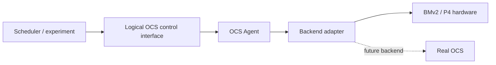

# ReconfigNet-Sim

[中文](README-zh.md)

ReconfigNet-Sim is a programmable-switch platform for low-cost investigation of the system-integration, control and deployment problems surrounding reconfigurable optical networks.

## Motivation

The central motivation is to use emulation not merely to reproduce an OCS data plane, but to expose, study, and de-risk the system-integration problems surrounding reconfigurable networks before real optical hardware is available.

Reconfigurable optical circuit switch (OCS) hardware is still difficult to obtain and operate. Many devices remain research prototypes or early products, production volume is limited, software support is incomplete and the cost of building a representative optical testbed is high.

This scarcity creates a system-integration gap. Schedulers, controllers, endpoint configuration, topology assumptions, deployment automation and failure handling are often developed before teams can exercise them against a real OCS. Problems in those layers then remain hidden until scarce hardware becomes the integration point.

ReconfigNet-Sim uses programmable-switch emulation to expose those problems earlier. It is not a replacement for optical validation. It is reusable research infrastructure for developing the surrounding system, making control behavior measurable and documenting which conclusions do and do not transfer to a physical OCS.

> [!NOTE]
> ReconfigNet-Sim is research infrastructure for system-integration experiments. It is not a substitute for optical validation, and results should be interpreted only within the documented model boundary.

## What the Platform Covers

The platform covers the system behavior needed to investigate reconfigurable-network integration. The exact model evolves with the surrounding research, but commonly includes:

- control and orchestration logic around dynamically reconfigurable networks;
- endpoint, topology and deployment assumptions that affect system integration;
- connection workflows, state transitions, validation, recovery and failure handling;
- interactions among clients, controllers, Agents, device backends and programmable-switch targets;
- measurement hooks for control paths and data-plane consequences.

The executable model and transaction details are deliberately kept in the [OCS Agent architecture](docs/ocs-agent-architecture.md), [control semantics](docs/ocs-control-semantics.md) and [simulation boundaries](docs/ocs-simulation-principles-and-boundaries.md) documents so they can evolve without changing the project’s high-level promise.

## What We Do NOT Emulate

ReconfigNet-Sim does not emulate or measure:

- optical propagation, insertion loss, optical power, BER or signal quality;
- MEMS, silicon-photonic or other physical switching mechanisms;
- transceiver tuning, laser behavior or wavelength-dependent behavior;
- physical link loss and reacquisition;
- PHY training, NIC initialization or driver recovery;
- transparent forwarding of arbitrary L1/L2 protocols;
- the data-plane atomicity or exact timing of a real optical reconfiguration.

These omissions are deliberate. They keep the model useful without presenting packet-switch state as optical truth. See [OCS simulation principles and boundaries](docs/ocs-simulation-principles-and-boundaries.md) for the precise assumptions.

> [!WARNING]
> A packet-level result from ReconfigNet-Sim must not be read as evidence of optical switching time, physical link recovery, or end-to-end OCS equivalence.

## Why P4?

A P4 switch provides a controllable approximation boundary within which a large class of OCS system-integration questions can be investigated before—and alongside—real hardware.

P4 gives this project a useful pair of experimental layers:

- **BMv2/P4App** provides a software target that is inexpensive, reproducible and fast to iterate. It is well suited to early controller, endpoint, deployment and failure-workflow experiments.
- **Tofino** provides a more mature programmable-hardware path with a packet-processing pipeline and BF-SDE/BFRT development environment. It lets the same integration questions be tested closer to a production programmable-switch deployment.

Neither layer supplies optical behavior. BMv2/P4App can have weaker fidelity when experiments depend on real RDMA NIC interaction, PHY behavior, link training or hardware timing. Tofino narrows some programmable-hardware and deployment gaps, but it remains an electrical packet switch and does not reproduce optical switching mechanisms.

The broader P4 development environment is available through [Open P4 Studio](https://github.com/p4lang/open-p4studio). This project uses P4 as an experimental boundary, not as a claim that a packet switch is a physical OCS.

> [!NOTE]
> BMv2/P4App and Tofino are complementary programmable-switch validation layers: BMv2 favors fast, reproducible iteration, while Tofino exercises a closer hardware and deployment path. Neither one adds optical fidelity.

## Research Questions Enabled

The repository supports experiments around questions such as:

1. Which scheduler, controller, endpoint and deployment assumptions fail when OCS-style connectivity becomes dynamically reconfigurable?
2. When device reconfiguration approaches sub-millisecond time scales, which portions of the control path become the bottleneck?
3. Which connection, batch, conflict, failure, rollback and recovery semantics are required for safe integration?
4. How do static neighbors, host routing, transport behavior and application recovery interact with a changing topology?
5. Can a future hybrid optical design keep adjacent electrical L1/L2 links established and change only an internal path, avoiding expensive endpoint link restart?

## Design Principles

- **Stable logical OCS abstraction.** Controllers address logical ports and connections rather than P4Runtime, BFRT or vendor-specific identifiers.
- **Explicit emulation boundary.** Desired state, backend acknowledgement and software readback are distinguished from physical optical state.
- **Measurable control path.** Validation, queuing, planning, delete, gap, install, readback and rollback timing remain separately observable.
- **Hardware and emulator portability.** The same connection semantics are retained across software P4 and P4 hardware backends.
- **Debug Mode for staged bring-up.** A diagnostic full-connectivity mode lets operators validate the packet network before enabling OCS matching. Its behavior and limitations are documented in [Debug Mode](docs/debug-mode.md).
- **Evidence before equivalence.** Results obtained from a packet switch are not described as real OCS behavior without a corresponding physical-hardware experiment.

> [!IMPORTANT]
> Debug Mode is for staged packet-network bring-up only. Disable it before OCS acceptance, matching, blackout, or connection-semantics measurements.

## Architecture

The stable project boundary is the logical OCS model and transaction semantics. Deployment-specific protocols and device SDKs sit behind that boundary:

Two deployment profiles are currently maintained because they represent different engineering frontiers:

| Profile | Primary objective | Boundary |
| --- | --- | --- |
| `python-monolith-http-direct` | Minimum single-request control latency | Python HTTP Agent Core and selected backend run in one process |
| `go-split-grpc` | Typed model, explicit backend contract and vendor SDK isolation | Go gRPC/gNMI Agent Core calls a Python Device Worker |

This table is intentionally only an orientation. Process boundaries, consistency modes, API behavior and backend ownership are documented in [OCS Agent architecture](docs/ocs-agent-architecture.md). P4App and Tofino operating instructions live with their targets: [P4App](targets/p4app/README.md) and [Tofino](targets/tofino/README.md).

## Performance / Measurements

Control latency is a first-class research variable. A fast physical switch does not produce a fast system if request serialization, network RTT, validation, process boundaries, SDK calls or device readback dominate the reconfiguration interval.

Measurements in this project therefore identify at least:

- client implementation and client-to-Agent RTT;
- northbound protocol and Agent deployment profile;
- Agent Core, Worker and process boundaries;
- P4Runtime, BFRT or future vendor backend;
- consistency mode and readback boundary;
- FULL or DELTA execution and sequential or native-batch transport;
- requested gap, control-plane completion and, when available, observed packet blackout.

The two maintained profiles should be treated as separate Pareto frontiers, not as proof that HTTP or gRPC is universally faster. Current instrumentation is described in the [architecture document](docs/ocs-agent-architecture.md); historical architecture comparisons and benchmark evidence are preserved in [docs/archive](docs/archive/README.md).

## Validation with Real OCS Hardware

The maintainers use this repository in ongoing OCS systems research and also have access to real OCS hardware. A public, reproducible emulator-versus-real-OCS comparison has not yet been published in this repository.

> [!NOTE]
> No public, reproducible emulator-versus-real-OCS comparison is currently included. Claims about physical OCS behavior require separately identified hardware evidence.

Until such artifacts are available, ReconfigNet-Sim does not claim physical equivalence. A future validation report must identify the device, topology, endpoint behavior, timing boundaries, control path, L1/L2 events and raw measurement artifacts instead of comparing only one aggregate latency number.

## Limitations

- The current data plane is an IPv4/MAC packet-level approximation, not a protocol-transparent optical path.
- ARP is not forwarded by the supported OCS pipelines, so experiments normally require preconfigured neighbor state.
- The electrical links remain up while OCS permission entries change; link-down/up and NIC recovery behavior are bypassed.
- `CONNECTED`, `TUNED` and peer state are derived from desired state, backend acknowledgement and readback, not optical telemetry.
- Debug Mode provides many-to-many packet reachability and must not be used to validate 1:1 OCS connection semantics.
- Available logical-port scale is constrained by the programmed table capacity and target resources.
- Site-specific addresses, MACs, physical ports and acceptance results belong in deployment repositories or external artifacts.

## Roadmap

The roadmap is governed by evidence rather than fixed dates:

- a new backend must preserve the logical connection and transaction contract and keep device-specific identifiers behind its adapter;
- a new fidelity claim must state which behavior is reproduced, derived, approximated or outside the model;
- a performance conclusion must report its complete execution path and retain reproducible raw artifacts;
- a claim about real OCS behavior requires a corresponding physical-hardware experiment;
- an experimental implementation becomes supported only after its configuration, failure semantics, tests and documentation are maintained together.

The [Draft/YANG support matrix](docs/ocs-model-support.md), [control semantics](docs/ocs-control-semantics.md) and [historical archive](docs/archive/README.md) record the current contract and its evolution.
