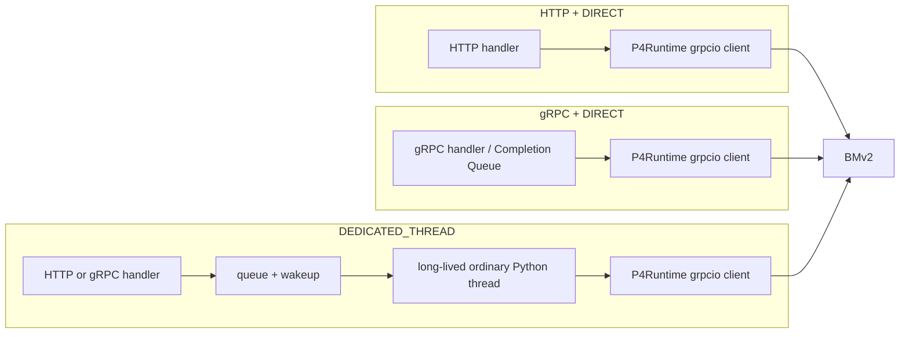

# OCS P4app HTTP/gRPC 性能与 southbound execution 复核

> 历史性能快照：保留落选 runtime 和 dedicated-thread 根因分析。当前只支持的两个 profile 见 [OCS Agent 当前架构](../ocs-agent-architecture.md)。

- 状态：P4app 历史基线；架构尚未最终选择
- 最新复核：2026-08-27
- 数据面：同机 BMv2 + P4Runtime
- 主数据：关闭 profiler 与线程日志的 5 轮重复采样
- 诊断数据：单独的 thread diagnostics、`pidstat` 与 `strace` 轮次

本文只记录可复用的 P4app/BMv2 结果和跨 backend 测量方法。真实 Tofino 地址、端口映射和 BFRT 实测数据只记录在 site-specific `testbed` 报告中。

## 1. 当前结论

1. `DEDICATED_THREAD` 不是对所有协议都更快。Python monolith HTTP 的 `DIRECT` 路径更短；Native Delta c1 p50 为 `3.718 ms`，dedicated 为 `4.532 ms`，线程交接使其增加 `0.814 ms`。
2. Python monolith gRPC 的结论相反。`DIRECT` 为 `8.551 ms`，dedicated 为 `5.024 ms`，改善 `3.527 ms`。改善集中在相同 P4Runtime delete/install/readback 的调用侧墙钟时间，而不是模型校验。
3. HTTP 与 gRPC 最终发给 P4Runtime 的 transition 和请求数量一致；计时差异来自 southbound grpcio client 所处的线程执行环境。`delete_commit_us` 等字段不是 BMv2 内部纯执行时间。
4. 因此不能把 dedicated thread 写成通用性能定律。它是针对“Python grpcio handler 同步嵌套调用另一个 grpcio client”的隔离手段；对没有该嵌套关系的 HTTP 路径，它会增加一次队列、唤醒和结果交接。
5. 当前生产目标仍是 gRPC/YANG，因此配置默认继续使用 `DEDICATED_THREAD`；`DIRECT` 保留为显式实验变量。是否拆分 Worker、Tofino 上选择何种 execution strategy，必须由 site-specific A/B 与真实 blackout 决定。

## 2. 公平性控制

最新 A/B 固定：

- Python monolith Agent；
- Go benchmark client，复用 HTTP keep-alive 或 gRPC channel；
- `CACHED_SYNC`；
- 完整 8 端口合法 `pi`；
- `NATIVE_BATCH`；
- 每个样本都是真实更新；
- c1：50 次 warmup、300 次采样；
- c4：100 次真实更新；
- 5 轮，HTTP/gRPC 顺序交替；
- 唯一主变量为 `DIRECT` 或 `DEDICATED_THREAD`；
- 主延迟轮次不启用线程日志、`strace` 或 `pidstat`。

`FULL` 和 `DELTA` 都执行一次 batch delete 与一次 batch insert；差异是 batch 内 entry 数量。`CACHED_SYNC` 在写后执行 P4Runtime readback，但不在写前做设备 pre-read。

## 3. P4app 主 A/B

单位为 ms；表中数值是 5 个独立轮次 p50 的中位数。

| NBI | Strategy | DIRECT client p50 | Dedicated client p50 | Dedicated - DIRECT | DIRECT programming | Dedicated programming |
| --- | --- | ---: | ---: | ---: | ---: | ---: |
| HTTP | FULL | 4.631 | 5.439 | +0.808 | 3.957 | 3.908 |
| HTTP | DELTA | 3.718 | 4.532 | +0.814 | 3.053 | 3.018 |
| gRPC | FULL | 10.379 | 5.875 | -4.504 | 8.650 | 3.961 |
| gRPC | DELTA | 8.551 | 5.024 | -3.527 | 6.772 | 3.103 |

尾时延方向一致：

| NBI | Strategy | DIRECT p99 | Dedicated p99 | Dedicated - DIRECT |
| --- | --- | ---: | ---: | ---: |
| HTTP | FULL | 5.950 | 7.320 | +1.370 |
| HTTP | DELTA | 4.119 | 4.910 | +0.791 |
| gRPC | FULL | 12.131 | 7.213 | -4.918 |
| gRPC | DELTA | 9.954 | 6.101 | -3.853 |

Native Delta c4 committed throughput：

| NBI | DIRECT | Dedicated | Dedicated 相对 DIRECT |
| --- | ---: | ---: | ---: |
| HTTP | 253.84 ops/s | 207.24 ops/s | -18.4% |
| gRPC | 112.35 ops/s | 188.97 ops/s | +68.2% |

这组结果确认了用户指出的现象：P4app Python monolith HTTP 确实是 `DIRECT` 更快，不是旧表格的偶然误差。

## 4. 为什么相同 P4Runtime 操作会测出不同时间

两条 NBI 路径生成的 backend 操作相同：

```text
delete changed entries -> requested gap -> install target entries
-> P4Runtime software readback
```

差别在调用所处的执行上下文：



`delete_commit_us`、`install_commit_us` 和 `readback_us` 是 client-side wall time，包含：

- protobuf/request 构造；
- grpcio 调度与 poller；
- BMv2 处理；
- completion 通知；
- 等待调用线程再次获得运行机会。

因此，“P4Runtime API 相同”只说明设备语义与 RPC 数量相同，不保证调用侧墙钟时间相同。gRPC NBI 的 handler 再同步进入 P4Runtime grpcio client 时，两个 grpcio 执行环境发生嵌套；dedicated thread 把 southbound 调用移到普通长期线程后，gRPC programming 从 `6.772 ms` 收敛到 `3.103 ms`。HTTP 本来没有这一层嵌套，dedicated 只增加约 `0.3 ms` server residual 和约 `0.5 ms` client/non-server 开销。

## 5. Profiler 与线程证据

Profiler 数据与主延迟数据分开采集，不参与上表。

线程诊断显示：

- HTTP `DIRECT`：Agent call 与 device call 使用同一个 HTTP handler thread；
- gRPC `DIRECT`：Agent call 与 device call 使用同一个 gRPC worker thread，但该线程同时处于 northbound grpcio server 执行环境；
- `DEDICATED_THREAD`：device call 固定在长期 southbound thread，handler 线程只等待结果；
- dedicated 的 device call thread identity 在请求间保持稳定。

`pidstat -t` 与 `strace -f -c` 显示两种模式都主要等待 `futex`、`epoll_wait`/`poll`，而 gRPC 轮次的 futex 等待明显高于 HTTP。`strace` 本身会显著放大时延，因此只能证明调度/等待形态，不能用其绝对时间替换主 benchmark。

现有证据足以支持“线程执行环境是必要变量”，但仍不足以把开销精确拆成 GIL、Completion Queue、grpc poller 各自的百分比。

## 6. Dedicated 模式下的历史架构矩阵

下表保留此前的 2×2/架构对照，用于回答语言与协议问题；它不与第 3 节的 execution A/B 混算。

| Agent runtime | NBI | Delta c1 p50 | Delta c1 p99 | Full c1 p50 | Delta c4 throughput |
| --- | --- | ---: | ---: | ---: | ---: |
| Python monolith | HTTP | 4.571 ms | 4.894 ms | 5.461 ms | 203.64 ops/s |
| Python monolith | gRPC | 5.074 ms | 5.406 ms | 5.829 ms | 192.02 ops/s |
| Python split | HTTP | 7.507 ms | 8.301 ms | 8.042 ms | 127.95 ops/s |
| Python split | gRPC | 7.138 ms | 9.834 ms | 7.711 ms | 127.26 ops/s |
| Go split | HTTP | 5.556 ms | 8.085 ms | 6.291 ms | 173.30 ops/s |
| Go split | gRPC | 5.405 ms | 7.506 ms | 6.235 ms | 181.22 ops/s |

在 dedicated 条件下，Python monolith gRPC 相对 HTTP 的 Delta p50 多 `0.503 ms`；Go split gRPC 相对 Python monolith gRPC 多 `0.331 ms`。这说明解决嵌套 grpcio 调度后，协议和 Worker 边界的典型开销都进入亚毫秒量级，但 p99 仍可能有更大差异。

## 7. Client 语言

P4app 历史固定 dedicated Agent、Native Delta、c1：

| Agent runtime | NBI | Go client p50 | Python 3.11 client p50 | Python - Go |
| --- | --- | ---: | ---: | ---: |
| Python monolith | HTTP | 4.571 ms | 5.091 ms | +0.520 ms |
| Python monolith | gRPC | 5.074 ms | 7.272 ms | +2.198 ms |
| Go split | HTTP | 5.556 ms | 5.481 ms | -0.075 ms |
| Go split | gRPC | 5.405 ms | 7.328 ms | +1.923 ms |

这些差值包含 client protobuf/JSON、HTTP/gRPC runtime、线程调度和容器环境，不是“语言计算速度”的 microbenchmark。部署评估必须固定 Agent、backend、网络与协议，再单独替换 client language。

## 8. Tofino/BFRT 评估 contract

迁移到 Tofino 时必须分别标定：

```text
client preparation
client <-> Agent network RTT
NBI decode/encode
Agent Core queue + lease/revision + validation
optional Core <-> Worker UDS boundary
BFRT delete
requested break-before-make gap
BFRT install + completion
optional software/hardware readback
request -> first new-path packet
last old-path packet -> first new-path packet (blackout)
```

以下变量必须显式写入每份结果：

- client language；
- NBI protocol；
- client 与 Agent 是否同机；
- Agent runtime；
- monolith/split Worker 边界；
- `DIRECT`/`DEDICATED_THREAD`；
- `CACHED_ACK`/`CACHED_SYNC`/`STRICT_DEVICE`；
- P4Runtime/BFRT backend；
- FULL/DELTA；
- sequential/native batch；
- profiler 是否启用。

主架构比较以关闭 instrumentation 的多轮数据为准。Profiler、线程日志和 `strace` 只能作为根因证据。

## 9. HTTP 的当前状态

HTTP adapter 已冻结并默认关闭，但暂不删除，原因是：

- 它仍是验证 gRPC 调度开销的重要控制组；
- P4app 与 Tofino 都已复现 HTTP `DIRECT` 更快的方向；
- 删除前需要先完成最终架构选择与证据归档。

Tofino 实验 HTTP 只允许 Python monolith、loopback 地址和显式 `--allow-frozen-http`；不会占用 `bf_switchd` 的端口，也不是生产部署入口。

## 10. 复现与证据

主 A/B 汇总：

```bash
python3 ocs.agent/benchmarks/summarize_execution_ab.py \
  --directory /absolute/path/to/raw/p4app \
  --output /absolute/path/to/raw/p4app/summary.json
```

运行时覆盖：

```bash
OCS_AGENT_RUNTIME=python-monolith \
OCS_CONSISTENCY_MODE=CACHED_SYNC \
OCS_SOUTHBOUND_EXECUTION=DIRECT \
  make run
```

将 `DIRECT` 改为 `DEDICATED_THREAD` 后重复同一轮次。线程诊断必须另开轮次：

```bash
OCS_THREAD_DIAGNOSTICS_FILE=/artifacts/threads.ndjson
```

本轮原始数据位于 workspace artifact store：

```text
artifacts/runs/20260827T034527Z-ocs-architecture-reassessment/raw/p4app
artifacts/runs/20260827T034527Z-ocs-architecture-reassessment/raw/profiler
```

## 11. 结果边界

- P4app 数值来自 BMv2/P4Runtime，不是 Tofino 性能承诺；
- `CACHED_ACK` 和 `CACHED_SYNC` 不能混在同一主表；
- p50 接近不代表 p99、吞吐、资源占用和恢复行为接近；
- API ACK 不等于数据面已经恢复；快切架构必须同时报告 blackout；
- `pi` 整表切换不代表稀疏单 connection 时延；
- 当前结果不授权删除 HTTP、Python monolith 或 split runtime；清理应在架构定案后单独执行。
