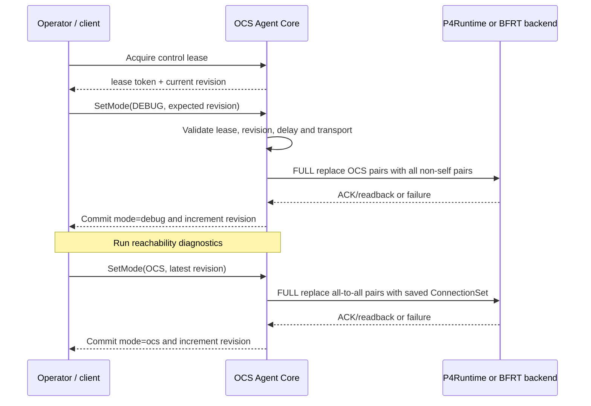

# Debug Mode

[English](./debug-mode.md)

- 状态：受支持的诊断行为
- 日期：2026-08-27
- 适用 profile：`python-monolith-http-direct` 与 `go-split-grpc`

## 目的

Debug Mode 是实验室分阶段 bring-up 工具。它会暂时使用 modeled port 之间的全连接 packet reachability 替换 OCS 风格的 1:1 连通关系，让实验人员在测试重构前检查可编程交换机、端侧地址、静态邻居、线缆和基础 IPv4 连通性。

它只回答一个范围明确的问题：*当 OCS matching 不再限制连通性时，包网络本身是否工作？* 它不能验证 OCS connection semantics、物理光学行为或任意 Ethernet 转发。

> [!IMPORTANT]
> Debug Mode 是用于分阶段 bring-up 的 many-to-many 诊断模式，不是 1:1 OCS matching 的替代品，不能用于 OCS 验收。

## 不要混淆三种 mode

当前有三项名称相近、作用完全不同的设置：

| 名称 | 取值 | 含义 |
| --- | --- | --- |
| P4App 配置 `mode` | `l2`、`l3` | P4App topology 启动时使用的端侧寻址和基础转发配置 |
| Agent runtime mode | `ocs`、`debug` | OCS 许可表使用 desired 1:1 connections，还是所有非自环 port pair |
| P4App `enable_debugger` | `true`、`false` | BMv2 是否启用 `bm_p4dbg` debugger |

`enable_debugger: true` 不会让 Agent 进入 Debug Mode。Tofino deployment file 可能仍包含 common configuration field，但真正改变 OCS table 行为的是 runtime `SetMode` 操作。

> [!WARNING]
> `mode: l2/l3`、runtime `ocs/debug` 和 `enable_debugger` 是彼此独立的设置。修改其中一个不会改变另外两个。

## 数据面行为

普通 OCS mode 中，每条双向逻辑 connection 产生两条有向许可表项：

```text
port-a -> port-b
port-b -> port-a
```

Debug Mode 安装所有 source 与 destination 不同的有向 pair：

```text
对于每个 source port s：
    对于每个 destination port d：
        当 s != d 时允许 (s, d)
```

因此，对于 `N` 个 logical port，Debug Mode 需要：

```text
N × (N - 1) 条有向表项
```

| 当前 target profile | Logical port | Debug 表项 | P4 table size |
| --- | ---: | ---: | ---: |
| P4App model | 8 | 56 | 64 |
| Tofino model | 6 | 30 | 64 |

更大的 model 必须为 target table 配置足够容量。这个需求按端口数量平方增长；普通 OCS mode 则只需要每条 active bidirectional connection 两条表项。

> [!NOTE]
> 这里的“全连接”只表示 modeled IPv4/MAC pipeline 内的所有非自环 pair，不提供透明 L2 转发，也不会取消静态 route、MAC state 和 neighbor 的要求。

这里的全连接仍然是一张 ingress/egress 许可表。数据包必须先经过受支持的 IPv4/MAC forwarding pipeline，因此 Debug Mode：

- 不转发 ARP；
- 对任意 L2 traffic 不透明；
- 仍依赖预配置的端侧 route、MAC state 和 neighbor；
- 仍会递减 IPv4 TTL，并执行 target 的 packet rewrite 行为。

这里的“全连接”只表示 modeled packet pipeline 范围内的全连接。

## 模式切换

两个受支持 Agent profile 使用相同的切换语义：



重要性质如下：

- Mode change 固定使用 `FULL` replacement，不是 DELTA connection update。
- `delay_us` 作用在删除 previous set 和安装 target set 之间。
- 只有所选 backend 声明支持时，才能使用 `SEQUENTIAL` 或 `NATIVE_BATCH`。
- Debug Mode active 时仍保留 desired `ConnectionSet`，不会把它转换成 all-to-all connection model。
- 返回 OCS mode 时，会把保留的 connection set 重新写入设备。
- 请求已经 active 的 mode 是幂等操作，不增加 revision。

## API 行为

每次 mode change 都是 write transaction，因此必须携带 active control lease 和 current expected revision。

### Python monolith HTTP

先获取 lease：

```http
POST /ocs_control/acquire HTTP/1.1
Content-Type: application/json

{"client_id":"lab-debug"}
```

使用响应中的 `lease_token` 和 `revision` 进入 Debug Mode：

```http
POST /ocs_mode HTTP/1.1
Content-Type: application/json
X-OCS-Control-Lease: <lease-token>
X-OCS-Expected-Revision: <revision>

{"mode":"debug","delay_us":0,"transport":"NATIVE_BATCH"}
```

使用 `GET /ocs_mode` 读取当前 runtime snapshot。退出 Debug Mode 时，使用前一次操作返回的最新 revision，再次写入 `"mode":"ocs"`。

### Go split gRPC

仓库提供的 client 会自动获取 lease 并填写 revision：

```bash
/usr/local/bin/ocs-control \
  --target 127.0.0.1:9339 \
  --operation mode \
  --mode debug \
  --transport native-batch \
  --delay-us 0
```

使用 `--mode ocs` 返回 OCS mode。程序化 client 调用 `OcsOperations.SetMode`，传入 `MODE_DEBUG` 或 `MODE_OCS`、`has_expected_revision=true`、当前 revision，并在 request metadata 中携带 lease token。

## Runtime 与 model state

Debug Mode active 时：

| Operation 或 state | 行为 |
| --- | --- |
| Runtime `mode` | `debug` |
| Active device pair | 所有 `N × (N - 1)` 个非自环 pair |
| Desired named connection | 保留，但不作为当前 active matching 下发 |
| Connection create/replace/delete | 以 `FAILED_PRECONDITION` 拒绝 |
| Batch 或 `pi` write | 以 `FAILED_PRECONDITION` 拒绝 |
| `GetPermutation` / HTTP `GET /ocs_mapping` | 拒绝，因为 all-to-all state 不是合法 `pi` |
| OpenConfig port status | `BLOCKED`、`connected=false` |
| 保留 connection status | `UNKNOWN` |

在测量 OCS matching、conflict rejection、sparse connection、reconfiguration blackout 或 connection-derived state 前，必须关闭 Debug Mode。

## 失败与一致性语义

只有 backend 完成所选 consistency boundary 后，Agent 才会提交新的 mode 和 revision：

- P4App 默认使用 `CACHED_SYNC`，包含写后 P4Runtime readback。
- Tofino 默认使用 `CACHED_ACK`；是否同步 readback 取决于 consistency mode。
- `STRICT_DEVICE` 会增加配置要求的 device precondition check。

如果更新失败，backend 会尝试恢复之前 active 的有向 pair。Rollback 成功时，previous runtime mode 和 revision 保持不变，并返回错误。如果 rollback 无法验证，runtime status 会进入 error/unknown，operator 必须先 recover device state。

这是控制面 transaction behavior，不会让 mode transition 具备数据面原子性。

## 推荐 bring-up 流程

1. 使用普通 OCS mode 启动所选 P4App 或 Tofino target。
2. 确认 Agent runtime 和 backend cache 已 ready。
3. 获取 single-writer lease，并记录当前 revision。
4. 使用零 requested gap 进入 Debug Mode。
5. 确认 runtime mode 为 `debug`，active entry 数量为 `N × (N - 1)`。
6. 对所有需要验证的 endpoint pair 执行 IPv4 reachability test。
7. 在排除 OCS matching 的情况下定位 addressing、static neighbor、routing、cabling 或 target startup 问题。
8. 使用最新 revision 返回 OCS mode。
9. 确认保留的 connection set、预期 active-entry 数量和 OCS-limited reachability 已恢复。

> [!WARNING]
> 不要在 OCS acceptance 中保持 Debug Mode：它会允许真实 1:1 OCS mapping 本应隔离的 pair 通信，从而掩盖错误的 connection intent。
