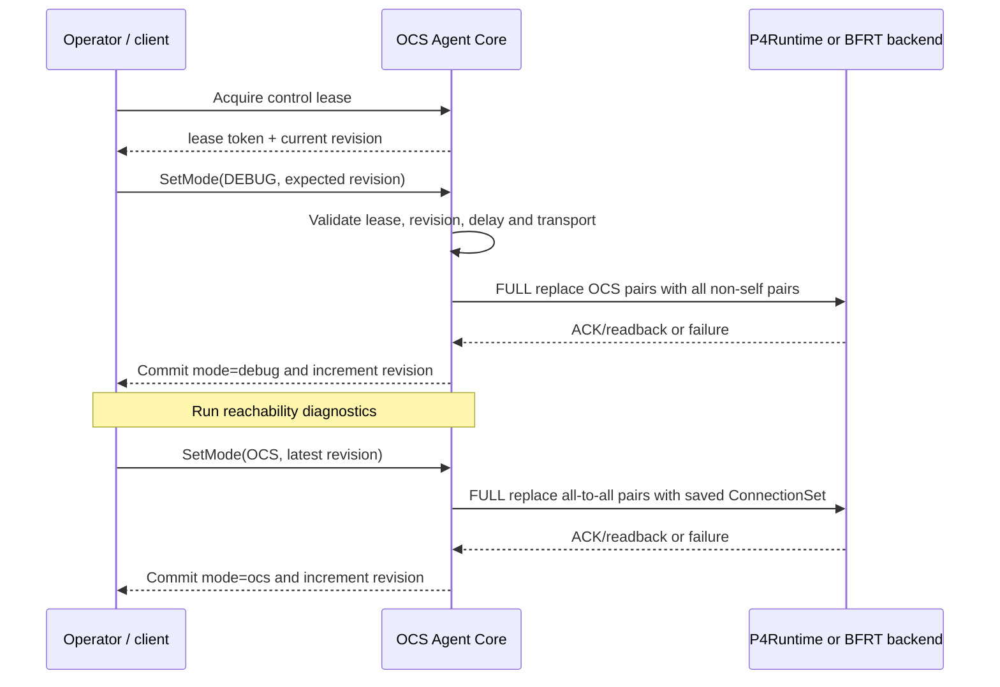

# Debug Mode

[中文](./debug-mode-zh.md)

- Status: supported diagnostic behavior
- Date: 2026-08-27
- Applies to: `python-monolith-http-direct` and `go-split-grpc`

## Purpose

Debug Mode is a staged lab bring-up tool. It temporarily replaces OCS-style 1:1 connectivity with full packet reachability between every pair of modeled ports so operators can check the programmable switch, endpoint addressing, static neighbors, cabling and basic IPv4 reachability before testing reconfiguration.

It answers a narrow question: *does the packet testbed work when OCS matching is not restricting connectivity?* It does not validate OCS connection semantics, physical optical behavior or arbitrary Ethernet forwarding.

> [!IMPORTANT]
> Debug Mode is a many-to-many diagnostic mode for staged bring-up. It is not a substitute for 1:1 OCS matching and must not be used for OCS acceptance.

## Do not confuse these modes

Three existing settings use similar words but control different things:

| Name | Values | Meaning |
| --- | --- | --- |
| P4App configuration `mode` | `l2`, `l3` | Endpoint addressing and baseline forwarding setup used when the P4App topology starts |
| Agent runtime mode | `ocs`, `debug` | Whether the OCS permission table contains the desired 1:1 connections or all non-self port pairs |
| P4App `enable_debugger` | `true`, `false` | Whether BMv2 starts with the `bm_p4dbg` debugger enabled |

`enable_debugger: true` does not enter Agent Debug Mode. Tofino deployment files may still contain the common configuration fields, but the runtime `SetMode` operation is the mechanism that changes OCS table behavior.

> [!WARNING]
> `mode: l2/l3`, runtime `ocs/debug` and `enable_debugger` are independent settings. Changing one does not change either of the other two.

## Data-plane behavior

In normal OCS mode, every bidirectional logical connection produces two directed permission entries:

```text
port-a -> port-b
port-b -> port-a
```

Debug Mode installs every directed pair for which source and destination differ:

```text
for every source port s:
    for every destination port d:
        permit (s, d) when s != d
```

For `N` logical ports, Debug Mode therefore needs:

```text
N × (N - 1) directed entries
```

| Current target profile | Logical ports | Debug entries | Programmed table size |
| --- | ---: | ---: | ---: |
| P4App model | 8 | 56 | 64 |
| Tofino model | 6 | 30 | 64 |

Any larger model must provision enough target table capacity. This requirement grows quadratically and is different from normal OCS mode, which needs only two entries per active bidirectional connection.

> [!NOTE]
> “Full connectivity” means all non-self pairs within the modeled IPv4/MAC pipeline. It does not provide transparent L2 forwarding or remove the need for static routes, MAC state and neighbors.

The full set is still an ingress/egress permission table. Packets must first traverse the supported IPv4/MAC forwarding pipeline, so Debug Mode:

- does not forward ARP;
- is not transparent to arbitrary L2 traffic;
- still uses preconfigured endpoint routes, MAC state and neighbors;
- still decrements IPv4 TTL and applies the target's packet rewriting behavior.

Calling it “full connectivity” means full connectivity within that modeled packet pipeline.

## Mode transition

Both supported Agent profiles use the same transition semantics:



Important properties:

- A mode change always uses `FULL` replacement. It is not a DELTA connection update.
- `delay_us` is applied between removing the previous set and installing the target set.
- `SEQUENTIAL` and `NATIVE_BATCH` are accepted only when the selected backend advertises them.
- The desired `ConnectionSet` is retained while Debug Mode is active; it is not converted into an all-to-all connection model.
- Returning to OCS mode writes that retained connection set back to the device.
- Requesting the already-active mode is idempotent and does not increment revision.

## API behavior

Every mode change is a write transaction and therefore requires the active control lease and current expected revision.

### Python monolith HTTP

Acquire a lease:

```http
POST /ocs_control/acquire HTTP/1.1
Content-Type: application/json

{"client_id":"lab-debug"}
```

Use the returned `lease_token` and `revision` to enter Debug Mode:

```http
POST /ocs_mode HTTP/1.1
Content-Type: application/json
X-OCS-Control-Lease: <lease-token>
X-OCS-Expected-Revision: <revision>

{"mode":"debug","delay_us":0,"transport":"NATIVE_BATCH"}
```

Read the current runtime snapshot with `GET /ocs_mode`. To leave Debug Mode, repeat the write with `"mode":"ocs"` and the latest revision returned by the previous operation.

### Go split gRPC

The repository client acquires the lease and supplies the revision automatically:

```bash
/usr/local/bin/ocs-control \
  --target 127.0.0.1:9339 \
  --operation mode \
  --mode debug \
  --transport native-batch \
  --delay-us 0
```

Return to OCS mode with `--mode ocs`. Programmatic clients call `OcsOperations.SetMode` with `MODE_DEBUG` or `MODE_OCS`, `has_expected_revision=true`, the current revision and the lease token in request metadata.

## Runtime and model state

While Debug Mode is active:

| Operation or state | Behavior |
| --- | --- |
| Runtime `mode` | `debug` |
| Active device pairs | all `N × (N - 1)` non-self pairs |
| Desired named connections | retained but not programmed as the active matching |
| Connection create/replace/delete | rejected with `FAILED_PRECONDITION` |
| Batch or `pi` write | rejected with `FAILED_PRECONDITION` |
| `GetPermutation` / HTTP `GET /ocs_mapping` | rejected because all-to-all state is not a valid `pi` |
| OpenConfig port status | `BLOCKED`, `connected=false` |
| Retained connection status | `UNKNOWN` |

Debug Mode must be disabled before measuring OCS matching, conflict rejection, sparse connection behavior, reconfiguration blackout or connection-derived state.

## Failure and consistency semantics

The mode value and revision are committed only after the backend completes the selected consistency boundary:

- P4App normally uses `CACHED_SYNC`, including post-write P4Runtime readback.
- Tofino normally uses `CACHED_ACK`; synchronous readback depends on the configured consistency mode.
- `STRICT_DEVICE` adds the configured device precondition checks.

If the update fails, the backend attempts to restore the previously active directed pairs. A successful rollback leaves the previous runtime mode and revision unchanged and returns an error. If rollback cannot be verified, runtime status becomes error/unknown and operators must recover device state before continuing.

This is control-plane transaction behavior. It does not make the transition data-plane atomic.

## Recommended bring-up workflow

1. Start the selected P4App or Tofino target in normal OCS mode.
2. Confirm that the Agent runtime and backend cache are ready.
3. Acquire the single-writer lease and record the current revision.
4. Enter Debug Mode with zero requested gap.
5. Verify that runtime mode is `debug` and active entries equal `N × (N - 1)`.
6. Run IPv4 reachability checks for all intended endpoint pairs.
7. Diagnose addressing, static-neighbor, routing, cabling or target-startup failures while OCS matching is removed from the test.
8. Return to OCS mode using the latest revision.
9. Verify that the retained connection set, expected active-entry count and OCS-limited reachability have been restored.

> [!WARNING]
> Do not leave Debug Mode enabled for an OCS acceptance run: it can hide incorrect connection intent by permitting traffic between pairs that a real 1:1 OCS mapping would isolate.
