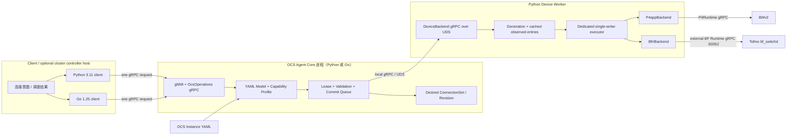
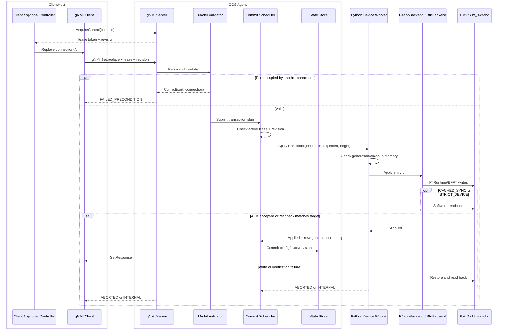
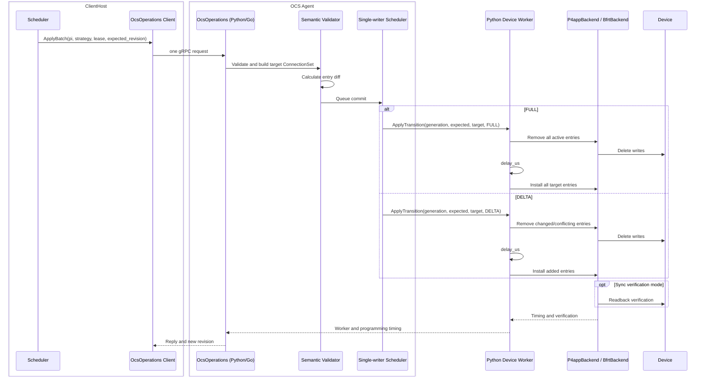

# OCS Agent API 设计与迁移方案

> 历史快照：本文记录最终定案前的候选 runtime matrix，不能作为当前配置或部署指南。当前架构见 [OCS Agent 当前架构](../ocs-agent-architecture.md)。
- 状态：P4app 与 Tofino 双 backend 已实现；最终 Agent 架构尚未选择

- 日期：2026-08-26

- 当前实现：共享 `ocs.agent` Core/contract，兼容 `ocs.p4app/ocs.p4app-rc2` 与 `ocs.tofino/net-ctrl`

## 1. 背景与设计目标
历史 P4app 控制面通过 HTTP 暴露 `pi` 映射和 `ocs/debug` 模式，并通过南向 P4Runtime gRPC 编程 BMv2。当前共享 Agent 已改用 gRPC/gNMI，并同时支持 P4app/P4Runtime 与 Tofino/BFRT。API Proposal draft 描述的不是一组已经定义完行为的 RPC，而是一棵面向 OCS 设备的 OpenConfig/YANG 风格配置与状态数据树。

本次迁移的目标不是简单地把 HTTP JSON 替换为 protobuf，而是：

1. 保留 draft 的端口、连接以及 `config/state` 基本定义；

2. 允许逐条连接操作和稀疏连接状态；

3. 保留 `pi` 作为完整双向配对的高效 batch 表示；

4. 将模型、事务和协议逻辑从 backend 中分离，使 P4app/P4Runtime 与 Tofino/BFRT 共用北向实现；

5. 明确区分真实实现、状态推导、后续计划和不支持能力；

6. 比较 Full/Delta、Sequential/Native Batch 的下发效率和故障语义。

## 2. Draft 的含义与本地实现关系
Draft 中：

- `config` 表示 controller 希望设备达到的 desired state；

- `state` 表示 agent 最近一次从 backend 验证到的 observed state；

- `rw` 表示 controller 可以配置；

- `ro` 表示 controller 只能读取；

- `leafref` 表示对模型树中另一个对象的引用。


Draft 没有最终确定写入事务、端口冲突、慢速建连、重启恢复、失败原因和连接状态机。本实现以 capability profile 固化当前选择，同时保留后续扩展空间。

本实现不声称支持完整 draft。gNMI `Capabilities` 只声明本地 OCS profile 及其版本；任何未实现的写入必须显式失败，不能静默忽略。
## 3. 系统边界
任意网络可达 host 都可以运行 Go/Python client 或集群 Controller。实际部署可把一个 master host 作为多 OCS 调度入口；Controller 与 OCS Agent 不要求同机。模型解析、权威合法性检查、lease/revision 和 desired state 收敛在 OCS-local Agent，因此 Controller 到 Agent 的网络 RTT 是显式部署变量，不会改变 OCS Agent 的 wire contract。



`Device Worker`、`P4appBackend` 和 `BfrtBackend` 都属于 OCS Agent，而不是远端 Controller。`python-monolith` 把 Core、Worker contract 和 backend 折叠在一个 Python 进程内；split runtime 保留显式 UDS 分层。P4app 与 Tofino 只在 Worker 所持有的南向 adapter 不同。
### 3.1 运行时组合
| Runtime | Agent Core | P4app | Tofino | Device 写入所有者 | 当前定位 |
| --- | --- | --- | --- | --- | --- |
| python-monolith | Python 3.5 | gRPC；HTTP 冻结 | gRPC；HTTP 仅受控实验 | 同进程 backend | 生产候选与低边界控制组 |
| python-split | Python 3.5 | gRPC；HTTP 冻结 | 未迁移 | Python Device Worker | P4app 历史实验变量 |
| go-split | Go 1.25 | gRPC；HTTP 冻结 | gRPC | Python Device Worker | 生产候选与显式分层方案 |

Agent runtime、client language 和 NBI protocol 是三个独立实验变量。client 的主对比是 Go 1.25 与 Python 3.11；Agent 内的 Python 3.5 是 P4app 基础镜像约束，不应与 client language 混为一谈。
### 3.2 Client / optional Controller 责任
- 产生单连接、完整具名连接集或 `pi`；

- 选择 Full/Delta batch 策略；

- 获取并每 10 秒续租 control lease；

- 每个写请求必须携带 lease token 和 `expected_revision`；

- 根据结构化冲突和错误原因决定重试；

- 使用稳定 logical port name，不感知 backend 端口号。

### 3.3 OCS Agent Core 责任
- 实现 draft 数据树的受支持子集；

- 管理 logical port inventory、capability profile 和 YAML 实例；

- 校验端口占用、连接结构和 `pi`；

- 管理 desired config、observed state、revision 和 request ID；

- 单写者 lease 默认 30 秒；Agent 重启使全部 lease 失效；

- 排队执行设备变更；把 expected/target entry set 交给 Device Worker；

- 将逻辑连接转换为 P4app 或 Tofino backend 操作。

### 3.4 Device Worker 与 backend contract
Device Worker 是南向设备所有者，不是 Go 与 Python 之间的“memory backend”。它维护带 generation 的设备缓存，接收协议无关的 expected generation/target directed entry set，并负责真实设备写入、P4Runtime/BFRT readback 和 rollback：

- `ReadEntries()`：读取 Worker cache；启动时 cache 来自真实设备读回；

- `apply(previous, target, strategy, delay_us, transport)`：执行 Full 或 Delta；

- `Reconcile()`：默认每 30 秒从设备读取并检测 silent drift；

- `Recover(REAPPLY_DESIRED)`：显式把 desired state 重新写到设备；

- backend 内部 `_restore(previous)`：失败时恢复并读回验证；

- `capabilities()`：声明 batch、readback 和原子性能力。


三种一致性模式的边界如下：

- `CACHED_ACK`：逐请求不做设备 pre-read，写成功以 southbound ACK 为准；周期 reconcile、显式 recovery 和启动检查仍做真实读回。它是 Tofino 当前默认，以避免每次写增加约 3.3 ms 的 BFRT software readback；
- `CACHED_SYNC`：不做设备 pre-read，但每次写后同步 software readback；保留作强同步对照；
- `STRICT_DEVICE`：每次写前额外读设备，并在写后同步读回；保留作诊断模式。

写失败且 rollback/readback 成功时保留旧 cache；rollback 失败或 Worker 断连会把 cache 标为 `UNKNOWN` 并阻止普通写。reconcile 发现外部修改时标为 `DRIFTED`，不会静默 adopt 外部状态。

#### 3.4.1 Southbound execution strategy

所有真实设备写入仍由单写者串行化，但 backend 方法有两种执行方式：

- `DIRECT`：在当前 NBI/Worker handler thread 内同步调用 southbound client；
- `DEDICATED_THREAD`：把同一个 backend 方法提交到长期存在的普通 Python 单写者线程，handler 等待结果。

两种方式不改变 transition、设备 RPC 数量、revision 或一致性语义。它们是必须显式记录的性能变量，不是不同的 backend。

```text
Python monolith:
HTTP/gRPC handler -> Agent Core -> dedicated executor -> backend

Split runtime:
HTTP/gRPC handler -> Agent Core -> UDS DeviceBackend RPC
  -> Worker handler -> dedicated executor -> backend
```

P4app 五轮、关闭 instrumentation 的 Python monolith Native Delta 结果如下：

| NBI | `DIRECT` client p50 | Dedicated client p50 | Dedicated - DIRECT | `DIRECT` programming | Dedicated programming |
| --- | ---: | ---: | ---: | ---: | ---: |
| HTTP | 3.718 ms | 4.532 ms | +0.814 ms | 3.053 ms | 3.018 ms |
| gRPC | 8.551 ms | 5.024 ms | -3.527 ms | 6.772 ms | 3.103 ms |

这组 A/B 的逻辑链是：

1. HTTP/gRPC 最终生成的 P4Runtime 操作和请求数一致；
2. `delete_commit_us`、`install_commit_us`、`readback_us` 是调用侧 wall time，不是 BMv2 内部时间；
3. gRPC handler 同步嵌套 P4Runtime grpcio client 时，`DIRECT` 会放大相同设备操作的等待时间；
4. dedicated thread 隔离了这一嵌套环境，所以 gRPC 大幅改善；
5. HTTP 没有 northbound grpcio 嵌套，dedicated 只增加 queue/wakeup/result handoff，因此 HTTP 反而变慢。

真实 BFRT 结果也表明方向依赖 NBI 和 consistency mode：HTTP 仍是 `DIRECT` 更快；Python monolith gRPC 在 ACK 模式下两者接近，在同步 readback 模式下 dedicated 更有利；Go split gRPC 的差值进入运行波动量级。具体数值只记录在 site-specific testbed 报告中。

当前 JSON 默认仍为 `DEDICATED_THREAD`，因为目标生产 NBI 是 gRPC，且它能避免 P4app 上已证实的严重退化。但这不是最终架构判定：每个 backend/consistency 组合都必须保留 `DIRECT` A/B，最终选型还要同时看真实 blackout、资源和故障边界。

测试中的 `FakeSwitch`/fake backend 只是内存中的 test double，用于注入写入失败、验证回滚和并发语义。它不参与 2×2 性能结论，也不是生产分层的一部分。所有权威性能数据均来自真实 BMv2/P4Runtime 闭环。

当前没有“Go southbound backend”：Go 只实现 NBI + Agent Core，P4Runtime/BFRT 都由 Python Device Worker 持有。直接 Go BFRT client 不在本阶段范围内；如果后续实现，应作为新的独立实验变量，而不是替换现有基线后再比较。
### 3.5 校验位置与性能分层
client 可以提前执行不依赖共享状态的检查，例如 protobuf/JSON schema、logical port name 格式、`pi` 是否为对称无自环排列。这类检查可以减少无效网络请求，但不能取代 Agent 的权威校验。

以下检查必须保留在 OCS-local Agent：active lease、`expected_revision`、端口当前占用、connection 冲突、commit 后重校验、Worker generation/cache status，以及当前 consistency policy 要求的 ACK/readback。把它们只放在远端 client 会受到 snapshot 过期和多 client 竞争影响，破坏单写者和 desired/observed 一致性。

每次性能测试按以下层次记录，避免把多个变量压成一个端到端数字：

```text
client preparation / revision serialization
  -> client-to-Agent RTT + HTTP/gRPC runtime
Agent Core queue + lease/revision + validation
  -> local call or UDS gRPC
Device Worker cache precondition + planning
  -> P4Runtime or BFRT
delete/install + optional device readback
```

client language、NBI protocol、client-to-Agent 网络、Agent Core runtime、Core/Worker 进程边界、consistency mode 和 southbound backend 必须作为独立实验变量。当前关键路径只发一个写请求，不要求每次写前额外读取 Agent 状态；controller 使用 lease 响应和上一次写响应中的 revision 串行推进。
## 4. 数据模型
### 4.1 Logical port
北向端口名称固定为 `port-<slot>`。slot 从 1 连续编号。P4app 中 slot 直接映射 BMv2 port；Tofino 由 site-specific hardware profile 映射到 `dev_port`，真实 front-panel 对应关系不进入可复用仓库。
### 4.2 Connection
首版 connection 包含：

- `connection-name`：唯一且稳定；

- `bidirectional`：首版必须为 `true`；

- `near-port-name`；

- `far-port-name`；

- observed `status`；

- observed rejection/failure 信息通过操作结果提供。


首版约束：

- near/far port 必须存在且不能相同；

- 每个 active port 最多属于一个 connection；

- 单条操作可以让未参与连接的端口保持空闲；

- 创建或修改遇到被其他 connection 占用的端口时拒绝，并返回冲突端口和占用者；

- 不隐式拆除其他 connection。

### 4.3 ConnectionSet 与 `pi`
`ConnectionSet` 是 agent 的主状态，可以表示稀疏连接。

`pi` 仅表示所有端口都恰好出现一次的完整、无自连接、双向 perfect matching。例如：

```text
pi = [2, 1, 4, 3]

connection port-1 <-> port-2
connection port-3 <-> port-4
```

如果 active `ConnectionSet` 是稀疏的，则它不能转换为合法 `pi`。此时：

- `OcsOperations.GetPermutation` 返回 `FAILED_PRECONDITION`；

- 迁移期 `GET /ocs_mapping` 返回 HTTP 409；

- 旧 `POST /ocs_mapping` 仍可通过合法 `pi` 恢复完整配对。

### 4.4 Config 与 observed state
`CACHED_SYNC/STRICT_DEVICE` 写入成功的判定包含：

1. backend 编程调用完成；

2. 从 P4Runtime 读回目标 table entries；

3. 读回结果与目标 `ConnectionSet` 一致；

4. agent 原子提交 config/state snapshot 和新 revision。


`CACHED_ACK` 则在 southbound 写 ACK 后提交 snapshot，并通过周期 reconcile、启动检查和显式 recovery 验证真实表状态。因此 `CONNECTED/TUNED` 只表示当前 Agent 认为目标 table entries 已提交或验证，不表示真实光功率、MEMS 位置或链路质量已经被测量；调用者可从 `write_verification` 和 `last_verified_unix_ns` 区分 ACK 与读回边界。
## 5. 北向接口
### 5.1 gNMI
首版实现：

- `Capabilities`；

- `Get`；

- `Set`；

- `Subscribe` 返回 `UNIMPLEMENTED`。


标准单连接操作：

- create/replace：对指定 `port-connection[connection-name=...]` 执行 `Set.replace`；

- delete：对该 list entry 执行 `Set.delete`；

- 同一 SetRequest 中的多个 operation 属于同一控制面事务；

- replace 整个 `optical-switch-connections` subtree 表示完整具名连接集替换。


首版 gNMI 使用 JSON_IETF encoding。写请求同步等待编程、配置的一致性验证和必要的回滚完成；`CACHED_ACK` 不逐请求等待 readback。
### 5.2 OcsOperations vendor service
服务提供：

- `AcquireControl` / `RenewControl` / `ReleaseControl` / `GetControlState`：单 active writer lease；

- `GetRuntime`：mode、status、revision、active entries 和 backend capabilities；

- `GetPermutation`：仅在连接集是完整 perfect matching 时返回 `pi`；

- `ApplyBatch`：输入具名 connection set 或 `pi`，选择 Full/Delta 和 transport；

- `SetMode`：保留 `ocs/debug` 模式；

- `RecoverDeviceState(REAPPLY_DESIRED)`：漂移或未知状态后的显式恢复；

- operation reply：request ID、revision、结构化错误、entry counts 和完整 timing。


所有写入必须携带 `x-ocs-control-lease` metadata，并在 request 中提供 `expected_revision`。缺少/过期/错误 lease 返回 `FAILED_PRECONDITION`，已有其他 holder 时 Acquire 返回 `RESOURCE_EXHAUSTED`，revision 不匹配返回 `ABORTED`。已经取得 commit slot 的事务即使执行期间 lease 到期也会完成。
### 5.3 HTTP compatibility adapter
HTTP 只作为迁移适配器，调用同一个 agent core：

- `GET /ocs_mapping` -> `GetPermutation`；

- `POST /ocs_mapping` -> `ApplyBatch(pi, FULL)`；

- `GET /ocs_mode` -> `GetRuntime`；

- `POST /ocs_mode` -> `SetMode`。

- `POST /ocs_control/acquire|renew|release` -> control lease；

- `POST /ocs_recover` -> `RecoverDeviceState`。


HTTP adapter 不再自行持有 mapping、锁、revision 或错误处理逻辑。 HTTP 写请求必须携带 `X-OCS-Control-Lease` 和 `X-OCS-Expected-Revision`；adapter 不会为了兼容旧 client 暗中获取 lease。
## 6. 单连接操作时序
下图显示 split runtime；`python-monolith` 将 Device Worker 和 backend 调用折叠到 Agent 进程内，其北向语义不变。


## 7. Batch 操作与原子性


必须区分：

- 控制面事务原子性：成功提交完整目标，或者恢复并保持旧 snapshot；

- 数据面瞬时原子性：所有 entry 是否在同一时刻切换。


软件回滚只能保证第一种。除非 backend capability 和实验结果证明支持，否则 agent 不声明数据面原子切换。
### 7.1 执行策略
- `FULL`：删除全部 active entries，等待 `delay_us`，安装全部 target entries；

- `DELTA`：删除 removed/changed entries，等待 `delay_us`，安装 added entries，保留 unchanged entries。

### 7.2 Transport
- `SEQUENTIAL`：每条 entry 一个设备写请求，是必需基线；

- `NATIVE_BATCH`：单个设备请求携带多个 update，仅在运行时 capability probe 和测试通过后启用；

- 请求 `NATIVE_BATCH` 但 backend 不支持时返回明确错误，不静默降级，除非调用者指定允许 fallback。

### 7.3 并发
- gRPC 解码、纯语义校验和读取可以并行；

- 所有设备变更进入单写者 commit queue；

- 事务获得执行位置后必须重新基于最新 snapshot 校验；

- Batch 在整个 apply、可选 readback 和 rollback 期间持有提交权；

- 首版不承诺端口级并行设备提交。


client 可以并行准备 request，但相同 active lease 下的成功写必须按响应中的 revision 串行推进。性能测试的 c4 因此报告 committed throughput 和排队后的 client latency，不以 stale revision 的快速失败冒充吞吐。
## 8. 错误与状态
结构化错误类别：

- `INVALID_ARGUMENT`：模型、端口名、connection 或 `pi` 非法；

- `FAILED_PRECONDITION`：端口冲突、debug 模式、稀疏状态无法表示为 `pi`；

- `RESOURCE_EXHAUSTED`：另一个 client 正持有 active control lease；

- `ABORTED`：revision 冲突，或设备更新失败但旧状态已恢复；

- `INTERNAL`：更新失败且恢复失败，observed state 进入 `UNKNOWN/FAILED`；

- `UNAVAILABLE`：Device Worker 断连或超时；revision 不推进，设备状态视为未知；

- `UNIMPLEMENTED`：不支持的 draft path、Subscribe 或 backend capability。


设备 cache 状态独立为 `READY`、`DRIFTED`、`UNKNOWN`。只有 `READY` 接受普通写；后两者要求持 lease 的 `RecoverDeviceState(REAPPLY_DESIRED)`，不会自动采用设备外部修改。

`CACHED_ACK` 在 southbound ACK 后返回成功；`CACHED_SYNC/STRICT_DEVICE` 在读回验证成功后返回成功。正常同步流程不会长期暴露 pending 状态；`PENDING_CONNECT/PENDING_DELETE/TUNING` 留给未来慢速物理 OCS 的异步实现。
## 9. Draft 支持矩阵
状态定义：

- ✅ `SUPPORTED`：存在真实执行逻辑；

- 🧮 `DERIVED`：由 Agent snapshot、设备 ACK 或最近一次读回推导；

- 🗓️ `PLANNED`：已有后续实现方向；

- 🚫 `UNSUPPORTED`：当前 profile 明确拒绝；

- ➖ `OUT_OF_SCOPE`：不属于 P4app 模拟器目标。


| Capability ID | Draft 能力 | 当前支持 | 实现真实性和行为 | 后续计划 / backend 注意事项 |
| --- | --- | --- | --- | --- |
| `optical-switch-state` | Optical switch 基本 config/state | ✅ `SUPPORTED` | gNMI 可读根对象和 Agent snapshot | 模型和事务层直接复用 |
| `connection-recovery` | Recovery behavior/capability | 🚫 `UNSUPPORTED` | Draft 持久化 reboot recovery 仍不声明；本地 `REQUIRE_MATCH` + `RecoverDeviceState` 是安全扩展 | 增加持久化后再映射 draft capability |
| `platform-port-identity` | Platform component name/type/index | ✅ `SUPPORTED` | 来自 logical port profile | hardware profile 映射 Tofino inventory |
| `port-enabled` | Port enabled | 🧮 `DERIVED` | 首版固定为 true；写入拒绝 | 后续增加 admin state |
| `port-alias-description` | Port alias/description | 🗓️ `PLANNED` | Get 省略；Set 拒绝 | 可加入 agent config store |
| `switch-side` | Switch side | 🚫 `UNSUPPORTED` | P4app/当前 Tofino profile 均无标准化可信来源 | 有硬件定义后支持 |
| `port-status` | Port status | 🧮 `DERIVED` | 从 Agent/table 状态映射为 TUNED/CONNECTED；不是光学遥测 | 真实 OCS 增加物理状态源 |
| `port-peer-connected` | Peer/connected | 🧮 `DERIVED` | 从已验证 ConnectionSet 推导 | Tofino 复用相同逻辑 |
| `error-counters` | Port/connection error counters | 🚫 `UNSUPPORTED` | 流量 packet/byte counter 不冒充错误计数 | backend 有错误源后支持 |
| `point-to-point-connections` | Point-to-point connections | ✅ `SUPPORTED` | 逐条 CRUD、稀疏状态、整表替换 | 核心跨 backend 能力 |
| `connection-rejection-reason` | Connection rejection reason | ✅ `SUPPORTED` | 结构化冲突和校验错误 | 持续扩展错误码 |
| `asynchronous-connection-state` | Async connection state machine | 🗓️ `PLANNED` | 首版同步到当前 consistency policy 的完成边界 | 慢速物理 OCS 时引入 |
| `connection-state` | Per-connection state | 🧮 `DERIVED` | CONNECTED、FAILED、UNKNOWN | 后续增加 TUNING/PENDING |
| `multicast-connections` | Multicast connections | 🚫 `UNSUPPORTED` | 当前 pipeline 无对应语义 | 需要独立 pipeline/backend 项目 |
| `soa-amplifier` | SOA/amplifier | ➖ `OUT_OF_SCOPE` | 不返回、不接受配置 | 仅真实光学 backend 考虑 |
| `full-connection-set-replace` | Full connection-set replace | ✅ `SUPPORTED` | gNMI subtree replace | Tofino 共用 |
| `permutation-batch` | `pi` permutation batch | ✅ `SUPPORTED` | vendor extension；强校验完整 perfect matching | 保持高效调度入口 |

机器可读 capability YAML 必须与本表一致，并由测试校验。
## 10. 配置文件职责
- P4app instance JSON：进程和部署配置，包括 `agent_runtime`、Device Worker UDS、一致性模式、southbound execution strategy、lease/reconcile 周期、监听地址和模型路径；

- `ocs-model.yaml`：logical ports、初始具名 connections 和 capability profile 引用；

- Tofino instance JSON：在共享字段之外声明 BF Runtime target、P4/table/action 名称、client/device/pipe ID、ownership lock 和 logical port 到 dev_port 的映射。


YAML 只作为模型实例和 profile，不代替 YANG schema，也不是另一个运行时 API。首版不支持 YAML 热加载。

`agent_runtime` 可取 `python-monolith`、`python-split`、`go-split`。测试部署可用 `OCS_AGENT_RUNTIME`、`OCS_CONSISTENCY_MODE` 和 `OCS_SOUTHBOUND_EXECUTION` 临时覆盖 JSON；持久部署应修改配置文件并纳入配置管理。当前默认 `DEDICATED_THREAD` 面向 gRPC 路径；`DIRECT` 必须继续保留为正式 A/B 变量，不能在架构定案前删除。
## 11. HTTP 到 gRPC 迁移指南
本节定义语义映射；可直接运行的 Python 调用示例、迁移步骤和稀疏状态处理见 [OCS HTTP 到 gRPC/gNMI 迁移指南](./ocs-http-to-grpc-migration-guide.md)。

| 旧 HTTP 调用 | 新调用 | 迁移说明 |
|---|---|---|
| `GET /ocs_mapping` | `OcsOperations.GetPermutation` | 稀疏状态不可表示；通用查询改用 gNMI Get connections |
| `POST /ocs_mapping {new_pi}` | `ApplyBatch {permutation, strategy=FULL}` | 保持旧 break-before-make 行为 |
| 完整 `pi` 的优化更新 | `ApplyBatch {permutation, strategy=DELTA}` | 减少写入和中断窗口 |
| `GET /ocs_mode` | `GetRuntime` | 返回 mode、revision、backend 状态 |
| `POST /ocs_mode` | `SetMode` | 保留 delay 和 timing |
| 无旧接口 | `AcquireControl/RenewControl/ReleaseControl` | 所有新写入必须显式持有 lease |
| 无旧接口 | `RecoverDeviceState(REAPPLY_DESIRED)` | drift/unknown 后显式恢复，不自动 adopt |
| 无旧接口 | gNMI connection replace/delete | 新增稀疏连接能力 |
| 无旧接口 | gNMI replace connections subtree | 使用 draft 对象进行整表配置 |

P4app 中 HTTP adapter 已默认关闭并冻结，只保留历史复现代码；Tofino 生产配置不启用 HTTP，仅允许显式安全开关下的 loopback A/B。删除 HTTP adapter 属于后续独立归档变更。
## 12. P4app 到 Tofino 迁移指南
必须保持不变：

- gNMI/OcsOperations wire contract；

- logical port name；

- ConnectionSet、`pi` 和语义校验；

- revision、commit queue、错误分类和 operation metrics；

- capability matrix 的含义。


Tofino 已只新增或替换 Device Worker 内部的设备部分：

- hardware profile；

- logical port -> dev_port 映射；

- 使用 BF-SDE Python client 连接外部 `bf_switchd:50052` 的 `BfrtBackend`；

- BFRT Full/Delta/Native Batch 操作；

- BFRT software/hardware readback、rollback 和独占 ownership lock；

- backend-specific capability 与 timing。


BFRT 对象没有泄漏到模型层，也没有复制北向 server 和事务状态。当前不计划让 Go Core 直接调用 BFRT；如后续验证官方 BF Runtime gRPC 的 Go client，可作为独立实验变量，不能混入本轮语言比较。

Tofino 验收复用与 P4app 相同的分层指标：client/NBI、Core、split Worker RPC、BFRT programming、readback 和端到端恢复。真实地址、dev_port 和 acceptance 数值属于部署仓库，不写入本可复用设计文档。
## 13. 性能与验收
P4app 历史矩阵与 Tofino/BFRT 评估方法见 [OCS HTTP/gRPC 性能对比](./ocs-http-grpc-performance.md)。`+1 ms`、p99 `110%` 和 throughput `90%` 只作为上一轮 promotion gate，不再等同于最终架构选择。最终决策至少同时比较：API p50/p99、真实 blackout、吞吐、资源占用、启动时间、故障域、部署复杂度和未来真实 OCS backend 的适配成本。具体设备结论只记录在部署仓库重评报告。

每次 operation 记录：

- queue wait；

- validation 和 planning；

- delete、gap、install、readback、rollback；

- end-to-end total；

- delete/insert/unchanged 数量；

- device write request 数量；

- 成功、语义拒绝、编程失败、回滚失败；

- p50/p95/p99 和不同 client concurrency 下的吞吐。


跨 backend 闭环验收：

1. 稀疏 connection create/replace/delete；

2. 端口冲突拒绝并返回占用 connection；

3. ConnectionSet 与 `pi` 双向转换及不可表示错误；

4. Full/Delta 结果等价；

5. Sequential/Native Batch capability 行为和性能对比；

6. revision 冲突与 commit queue；

7. P4Runtime/BFRT ACK、software readback 与 hardware audit 边界；

8. 写入失败、回滚成功和回滚失败；

9. HTTP、gNMI、OcsOperations 状态一致；

10. control lease 冲突、续租、释放、过期和 in-flight commit 语义；

11. `CACHED_ACK/CACHED_SYNC` 正常写零 device pre-read、周期 reconcile 和显式 drift recovery；

12. backend contract 测试不依赖 P4app 类型；

13. `REQUIRE_MATCH` 启动不一致时阻止普通写，直到显式 recovery；

14. BFRT ownership lock 阻止第二个 Agent 同时持有同一设备。
