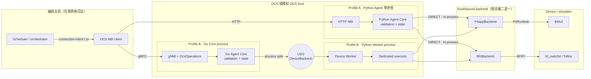
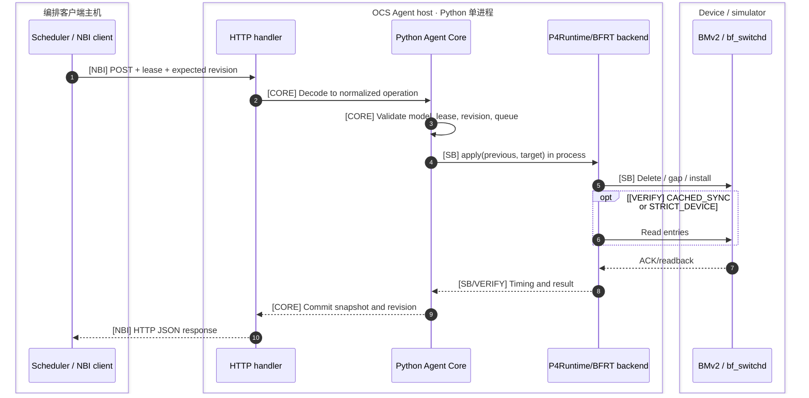
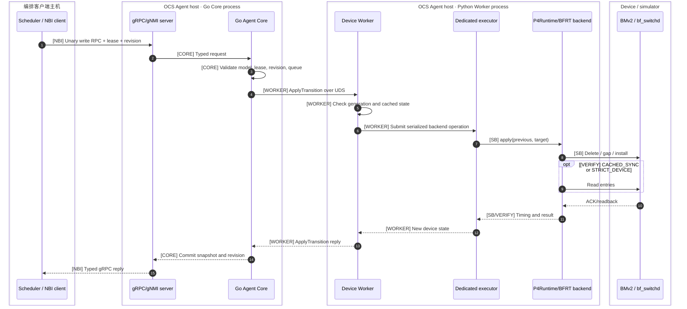

# OCS Agent 当前架构

> [!IMPORTANT]
> 当前只支持 `python-monolith-http-direct` 与 `go-split-grpc` 两个部署 profile。它们是面向不同目标的两个 Pareto frontier，不是可以任意排列组合的 runtime matrix。

- 状态：当前设计基线
- 日期：2026-08-27
- 适用 backend：P4App/P4Runtime、Tofino/BFRT

## 1. 架构决定

系统只保留两个可部署 profile。它们分别位于当前设计的两个 Pareto frontier，而不是彼此的临时兼容模式。

| Deployment profile | 固定实现 | 优化目标 | 代价 |
| --- | --- | --- | --- |
| `python-monolith-http-direct` | Python Agent Core + HTTP NBI + in-process backend + `DIRECT` | 最低单请求控制延迟、最少进程边界 | 没有显式 Worker RPC contract；vendor SDK 与 Core 同进程 |
| `go-split-grpc` | Go Agent Core + gRPC/gNMI + UDS DeviceBackend + Python Worker + dedicated executor | 类型化 YANG contract、进程隔离、vendor SDK 隔离、支持远端编排客户端 | 多一次本地 RPC 和进程调度，单机延迟略高 |

不再提供 Python split、Python gRPC NBI、Go HTTP NBI，也不接受旧 runtime matrix 配置。历史实现、测试数据和选择过程见 [`docs/history/`](./history/README.md)。

## 2. 部署边界

外部 Scheduler/orchestrator 及其 OCS NBI client 可以部署在任意网络可达的第三方 host。本文将这一侧称为“编排客户端”，不把它称为 OCS controller：它产生连接意图、持有 lease 并调用 NBI，但不直接维护设备状态，也不访问 P4Runtime、BFRT 或 vendor SDK。

真正承担设备侧 controller 职责的是 OCS Agent Core：它把意图转换成连接状态和 backend transition，并维护 desired/observed state、lease、revision 与错误状态。OCS Agent 部署在能够访问 OCS 或模拟 OCS 的主机；Device Worker、dedicated executor 和 P4Runtime/BFRT adapter 都属于 OCS Agent。



图中的 P4App 与 Tofino backend 是部署时二选一，不会同时写两个设备。Go split 的显式边界位于 Go Core 与 Python Worker 之间；Python monolith 则把 Core 和所选 backend 放在同一进程。

同一设备同一时刻只能由一个 profile 持有。Tofino launcher 使用 ownership lock 防止两个 Agent 同时写 BFRT。

## 3. 共享语义

两个 profile 共享以下控制语义：

- YAML model 定义 logical ports、初始具名连接和 capability profile；
- `ConnectionSet` 是 Agent 内部的规范化连接表示，可以是稀疏连接集；
- `pi` 是完整、无自环、双向 perfect matching 的 batch 表示；
- 所有写请求经过 lease、`expected_revision`、端口占用和模型校验；
- 支持逐条连接操作，以及 `FULL`/`DELTA` 整表替换；
- 设备写入失败时尝试恢复旧表并验证；
- desired state、observed state、revision 和结构化错误的含义一致；
- backend 只接收逻辑 directed entry set，不参与北向协议解析。

HTTP profile 仍实现上述统一 Agent Core 语义，不恢复早期无 lease、无 revision 的 legacy fast path。差异只在 wire protocol 和进程边界。

Draft/YANG 支持范围见 [OCS model support](./ocs-model-support.md)，更精确的事务约束见 [OCS control semantics](./ocs-control-semantics.md)。

## 4. 两条执行路径

时序图使用同一组性能分段标签，后续报告可以直接按这些边界统计：

| 标签 | 范围 | 是否受部署位置影响 |
| --- | --- | --- |
| `NBI` | client preparation、网络传输、HTTP/gRPC decode/encode | 是；跨机时主要增加网络 RTT |
| `CORE` | 模型、lease、revision、端口冲突校验与 commit queue | 否，主要受 Core 实现和竞争影响 |
| `WORKER` | Go Core ↔ Python Worker 的 UDS RPC、generation/cache 检查 | 仅 `go-split-grpc` 存在 |
| `SB` | backend planning、delete、gap、install 和 southbound completion | 是；由 P4Runtime/BFRT/vendor SDK 决定 |
| `VERIFY` | post-write readback，或 `STRICT_DEVICE` 的 pre-read | 是；由 consistency mode 和设备读路径决定 |

### 4.1 Python monolith HTTP/DIRECT



此路径没有 Worker RPC，也没有 dedicated executor。实验已经确认：HTTP handler 不存在 northbound grpcio 嵌套，同步 backend 调用本身最快；增加 dedicated thread 只会增加 queue、wakeup 和 result handoff。

### 4.2 Go split gRPC + dedicated Worker



Dedicated executor 是此 profile 的固定设计，不再是配置变量。它保证同步 P4Runtime/BFRT client 调用始终在 backend-owned 单线程中执行，并隔离 Python gRPC Worker handler 与 vendor runtime。

## 5. Backend contract

Go Core 与 Python Worker 通过 `DeviceBackend` gRPC contract 通信：

- `Capabilities`：backend、transport、readback 和 verification 能力；

- `ReadEntries`：读取 Worker cache；

- `ApplyTransition`：传入 expected generation、previous/target entries、策略和 transport；

- `Reconcile`：从设备检查 silent drift；

- `Recover`：显式把 desired state 重新写回设备。


Worker 启动时从真实 backend 建立 cache。普通请求不需要先做一次 northbound 读；编排客户端根据上一次写响应推进 revision，Worker 根据 generation 和 cached entries 检查 southbound 前置条件。

| Backend | 南向接口 | Adapter 所在位置 | 北向语义差异 |
| --- | --- | --- | --- |
| P4App | P4Runtime gRPC | Python Agent/Worker | 无   |
| Tofino | BFRT Python SDK / external BF Runtime | Python Agent/Worker | 无   |

未来 vendor OCS SDK 只需实现同一 backend 行为，不应进入 Go Core 或编排客户端。

## 6. 一致性模式

一致性模式决定“写成功”在哪个事实边界返回，以及 Agent 多久重新核对真实设备：

| Mode | 写前设备读取 | 成功返回边界 | 真实设备核对频率 | 当前用途 |
| --- | --- | --- | --- | --- |
| `CACHED_ACK` | 无 | southbound ACK；随后更新 Agent/Worker cache | 周期 reconcile，默认 30 秒；也可显式 reconcile/recovery | Tofino 低延迟默认 |
| `CACHED_SYNC` | 无 | 写后 software readback 与 target 一致 | 每次 changed write | P4App 默认；需要同步验证时使用 |
| `STRICT_DEVICE` | 有 | pre-read 通过，且写后 readback 与 target 一致 | 每次 changed write，包含写前与写后两次读取 | 诊断或强前置条件 |

因此 `CACHED_ACK` 中，“ACK → Agent cache”在当前请求内完成，但外部工具绕过 Agent 修改交换机造成的 silent drift，通常要到下一次 reconcile 才会被发现；默认周期下发现窗口约为 0–30 秒。`CACHED_SYNC` 把这次核对放进请求关键路径，`STRICT_DEVICE` 还额外增加一次写前设备读取。

> [!NOTE]
> 2026-08-27 的 Tofino02/BFRT A/B 中，固定 Python monolith HTTP/DIRECT 时，Native Delta c1 p50 从 `CACHED_ACK` 的 4.237 ms 增至 `CACHED_SYNC` 的 7.188 ms，即同步 readback 约增加 2.951 ms；历史 Python monolith gRPC/dedicated 对照从 6.166 ms 增至 9.150 ms，增加 2.984 ms。这说明当时 BFRT software readback 的量级约为 3 ms，但不是对其他 SDE、ASIC、负载或未来 vendor SDK 的性能承诺。`STRICT_DEVICE` 还会增加一次 pre-read，必须在目标环境单独实测。

Profile 固定的是进程执行方式，不是 consistency mode。性能报告必须同时记录 deployment profile、client 语言、网络 RTT、backend、consistency mode、策略和 transport。

## 7. 配置

配置通过 `deployment_profile` 一次性选择路径，不再支持 `agent_runtime`、`enable_rest_api`、`enable_grpc_api`、`rest_api` 或 `device_worker`。

Python HTTP 示例：

```json
{
  "deployment_profile": "python-monolith-http-direct",
  "http_api": {"host": "0.0.0.0", "port": 5000},
  "device": {"consistency_mode": "CACHED_SYNC"},
  "backend": {"type": "p4app"}
}
```

Go split 示例：

```json
{
  "deployment_profile": "go-split-grpc",
  "grpc_api": {"host": "0.0.0.0", "port": 9339},
  "device": {"consistency_mode": "CACHED_ACK"},
  "worker": {
    "target": "unix:///tmp/ocs-device-worker.sock",
    "timeout_seconds": 10
  },
  "go_agent": {"binary": "/usr/local/bin/ocs-go-agent"},
  "backend": {"type": "bfrt"}
}
```

`OCS_CONSISTENCY_MODE` 是唯一保留的 runtime 环境覆盖。部署 profile 和执行边界必须写入 JSON，保证启动行为可审计。

## 8. 默认部署与迁移

- P4App 默认：`ocs.agent/config/p4app.json`，即 Python monolith HTTP/DIRECT；
- P4App Go split：显式使用 `ocs.agent/config/p4app-go-split-grpc.json`；
- Tofino 默认：site-specific desired JSON 使用 `go-split-grpc`；
- Tofino HTTP/DIRECT：允许作为最低延迟 profile，但 BF-SDE control process 占用 TCP/5000 时必须选择其他端口。

Tofino 的 embedded `setup.py` 只负责加载基础 L3 表项和初始 OCS mapping，不再启动另一套 REST writer。这样所有运行期变更都经过两个正式 profile 之一，避免绕过统一的 lease、revision、rollback 和 ownership 语义。

旧配置迁移：

| 旧设置 | 当前替换 |
| --- | --- |
| `agent_runtime=python-monolith` + HTTP | `deployment_profile=python-monolith-http-direct` |
| `agent_runtime=go-split` + gRPC | `deployment_profile=go-split-grpc` |
| `device_worker.consistency_mode` | `device.consistency_mode` |
| `device_worker.target/timeout_seconds` | `worker.target/timeout_seconds` |
| `southbound_execution` | 删除；由 profile 固定 |
| `enable_*_api` | 删除；由 profile 固定 |

编排客户端若从 HTTP 迁移到 gRPC，需要把 `/ocs_mapping` 写替换为 `OcsOperations.ApplyBatch`，把逐条连接操作替换为 gNMI `Set`，同时继续维护 lease 和 revision。若保留 HTTP frontier，调用语义不变，只需使用新的部署配置。

## 9. 性能判定

两个 profile 解决不同目标：

- HTTP/DIRECT 是单机最低延迟基线；
- Go split gRPC 接受本地 UDS/进程边界开销，换取 typed contract 和 vendor 隔离。

对比时必须拆分并报告：client preparation、client-to-Agent RTT、NBI runtime、Core validation/queue、Worker RPC、backend queue、delete/install/readback，以及真实数据面 blackout。不能只用端到端均值解释协议或语言效应。

当前决定依据和历史 A/B 数据在 [历史性能报告](./history/ocs-http-grpc-performance.md) 中保存。完整 Tofino 数值与快切验收属于部署仓库；本文只保留解释 consistency trade-off 所需的代表性量级。

## 10. 验证入口

```bash
# Python shared semantics and both backends
PYTHONPATH="$PWD/ocs.agent:$PWD/ocs.p4app/ocs.p4app-rc2" \
  PYTHONDONTWRITEBYTECODE=1 \
  python3 -m unittest discover -s ocs.agent/tests -v

# Go Core and typed NBI
cd ocs.agent/go-agent
go test ./...
go test -race ./...

# P4App container
cd ../../ocs.p4app/ocs.p4app-rc2
make test-container
```

Benchmark matrix 只接受两个当前 profile，并直接报告 split 相对 monolith 的绝对微秒差和百分比。
